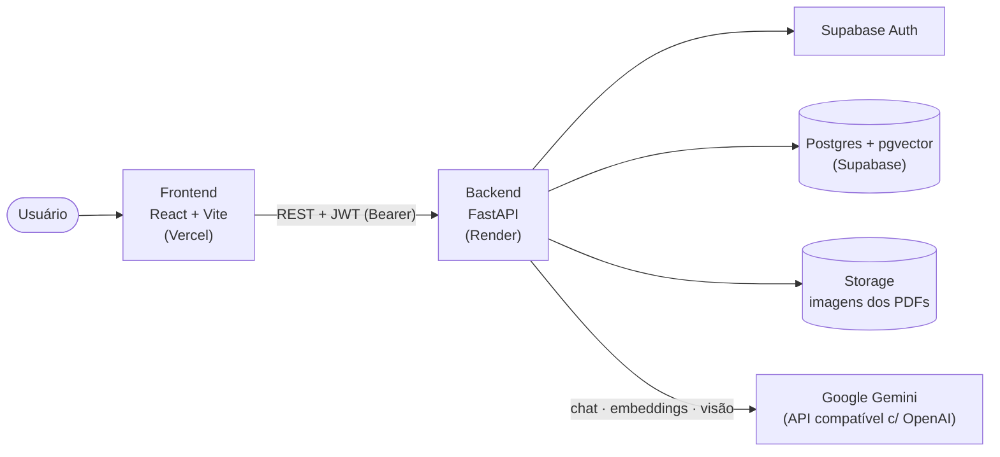
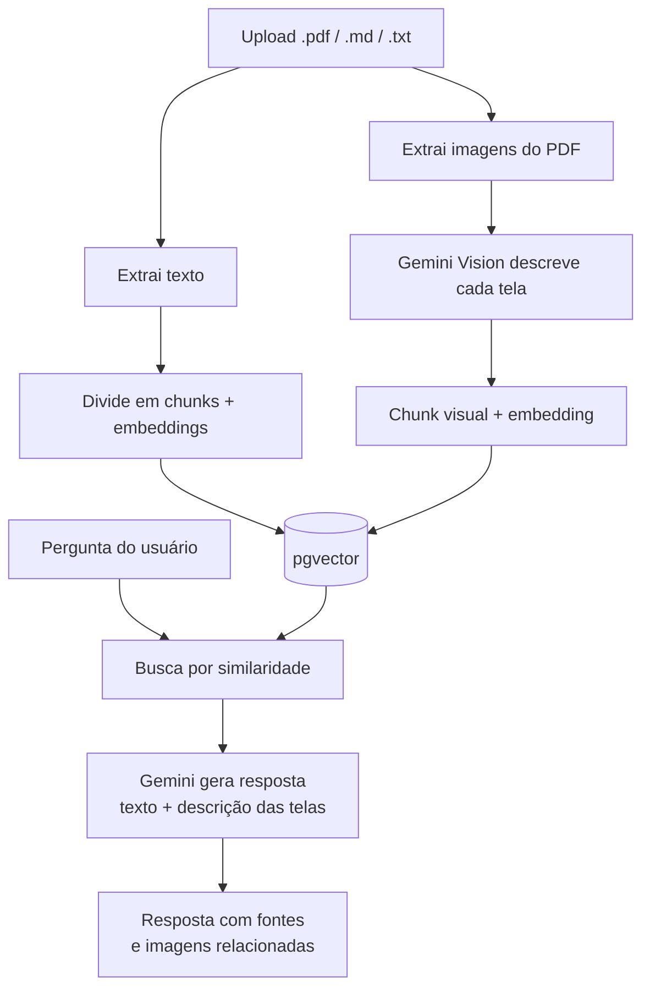

# ScribeMind AI

**Transforma documentação corporativa passiva (PDFs, manuais, guias visuais) em um assistente de chat ativo, que responde com base nas fontes oficiais da empresa — interpretando inclusive as _imagens_ dos documentos.**

[](https://scribemind-ai-alpha.vercel.app)
&nbsp;


> 🔗 **Aplicação no ar:** https://scribemind-ai-alpha.vercel.app
> Crie uma conta em segundos (sem confirmação de e-mail), suba um documento e pergunte.

---

## O problema → a solução

Empresas guardam seus processos em PDFs, manuais e ferramentas de documentação visual (tipo Scribe/ScribeHow, cheias de prints anotados). Com o tempo esses materiais viram arquivos pouco consultados, difíceis de encontrar e **dependentes de pessoas-chave** para interpretação.

O **ScribeMind AI** transforma essa documentação em um assistente que:

- entende **texto e imagens** dos documentos (RAG multimodal);
- responde em linguagem natural **citando a fonte**;
- mede a **adoção** e identifica **lacunas** na base de conhecimento;
- atende **múltiplas organizações** com governança e controle de acesso;
- é **acessível** (leitor de tela, voz, Libras, alto contraste).

É documentação que deixa de ser arquivo morto e vira **conhecimento operacional consultável** — reduzindo tempo de busca e dependência de especialistas. Exatamente a proposta da transformação digital.

---

## Arquitetura



### Fluxo de indexação e resposta (RAG multimodal)



---

## Destaques de engenharia

- **RAG multimodal:** combina o texto do documento com a **descrição por IA das telas** (Gemini Vision), permitindo respostas como _"nessa etapa, clique no botão Salvar"_.
- **Camada de IA agnóstica de provider:** um único client compatível com OpenAI; troca entre **Gemini** (padrão, free tier), OpenAI ou Ollama apenas por variável de ambiente.
- **Multi-tenant com governança:** organizações isoladas, papéis (`owner`/`admin`/`member`), permissão granular de dashboard, **histórico de auditoria** e **Row Level Security** no banco como defesa em profundidade.
- **Inteligência operacional:** métricas de adoção e **identificação automática de lacunas** (o que perguntaram e o bot não soube responder).
- **Acessibilidade de verdade:** WCAG 2.2/ARIA, Text-to-Speech, Speech-to-Text, **VLibras**, alto contraste, navegação por teclado e auditoria com axe-core.
- **Pronto para produção:** deploy contínuo (Render + Vercel), CORS configurável, limites de upload, modo claro/escuro.

---

## Funcionalidades

### IA Vision e RAG multimodal
- Descrição real das imagens via IA Vision (Google Gemini)
- *Chunks visuais* a partir das descrições, vinculados à imagem de origem
- Chat que combina texto + telas, citando as fontes usadas
- Visualizador de imagens embutido (lightbox), descrição e status por imagem

### Multiusuário e organizações
- Cadastro/login (Supabase Auth); criação de org (owner) ou entrada por **código de convite** (member)
- Permissões por papel `owner` > `admin` > `member` e isolamento por organização
- Gestão de equipe (papéis, remoção) e **acesso granular ao dashboard** com fluxo de solicitação/aprovação

### Gestão do conhecimento
- Histórico de conversas com sidebar para retomar
- Biblioteca de documentos com busca, filtro e metadados (chunks/imagens)
- Reprocessamento (re-gera embeddings e descrições) sem reenviar o arquivo

### Inteligência operacional (dashboard)
- Métricas de uso, gráfico de perguntas (7 dias)
- Perguntas sem resposta e lacunas na base de conhecimento

### Governança e segurança
- Histórico de auditoria das ações sensíveis (painel admin/owner)
- Validação de upload (tamanho, vazio, UTF-8)
- Row Level Security por organização no Postgres

### Acessibilidade (WCAG 2.2 / ARIA)
- `alt text` com a descrição da IA, TTS, STT, VLibras, alto contraste, escala de fonte
- Navegação por teclado, *skip links*, *live regions* e auditoria axe-core

---

## Stack

**Backend:** Python · FastAPI · Supabase (Auth + Postgres + Storage) · pgvector · SDK compatível com OpenAI (Gemini por padrão) · PyMuPDF · Pillow · pypdf

**Frontend:** React · Vite · Tailwind CSS · @axe-core/react

**Infra:** Render (API) · Vercel (web) · UptimeRobot (keep-alive)

### Tabelas principais
`organizations` · `profiles` · `organization_members` · `dashboard_access_requests` · `documents` · `document_versions` · `chunks` (com `image_id`) · `document_images` · `conversations` · `messages` (com `answered`) · `audit_logs` · `feedback`

---

## Rodando localmente

### Backend

1. Crie `backend/.env` a partir de `backend/.env.example`:

```env
SUPABASE_URL=
SUPABASE_KEY=

# Provider de IA (compatível com OpenAI). Padrão: Google Gemini (free tier).
# Chave gratuita em https://aistudio.google.com/apikey
AI_API_KEY=
AI_BASE_URL=https://generativelanguage.googleapis.com/v1beta/openai/
CHAT_MODEL=gemini-2.5-flash-lite
VISION_MODEL=gemini-2.5-flash-lite
EMBEDDING_MODEL=gemini-embedding-001
EMBEDDING_DIM=768

USE_MOCK_AI=false     # true = não chama a IA (mock, sem gastar cota)
MAX_UPLOAD_MB=10
```

> **Outros providers:** OpenAI → `AI_BASE_URL=https://api.openai.com/v1`, modelos `gpt-4o-mini` / `text-embedding-3-small`, `EMBEDDING_DIM=1536`. Ollama → `AI_BASE_URL=http://localhost:11434/v1`. A dimensão precisa bater com a do banco.

2. No Supabase → **Authentication > Providers**: habilite **Email** e **desligue "Confirm email"** em dev.

3. Rode as migrações (em `backend/scripts/`) no **SQL Editor**, nesta ordem — escolha **"Run without RLS"** em todas, **exceto** a última (`migration_rls.sql`), em que o RLS é ativado de propósito:
   - `migration_add_image_id_to_chunks.sql`
   - `migration_multiuser.sql`
   - `migration_analytics.sql`
   - `migration_dashboard_access.sql`
   - `migration_gemini_embeddings.sql` _(define embeddings em 768 dimensões)_
   - `migration_audit.sql`
   - `migration_rls.sql` _(Row Level Security)_

4. Suba a API:

```bash
cd backend
pip install -r requirements.txt
uvicorn app.main:app --host 127.0.0.1 --port 8000 --reload
```

### Frontend

```bash
cd frontend
npm install
# opcional: crie frontend/.env com VITE_API_BASE=http://127.0.0.1:8000
npm run dev
```

---

## Deploy

- **Backend (Render):** blueprint em [`render.yaml`](render.yaml). Defina no painel os segredos `SUPABASE_URL`, `SUPABASE_KEY`, `AI_API_KEY` e `CORS_ORIGINS`.
- **Frontend (Vercel):** Root Directory = `frontend`, variável `VITE_API_BASE` apontando para a URL do Render.
- **Keep-alive:** um monitor no UptimeRobot pingando `/health/` evita a hibernação do plano gratuito do Render.

---

## API

| Método | Rota | Acesso | Descrição |
|--------|------|--------|-----------|
| POST | `/auth/register` | público | Cadastro + criação/entrada em organização |
| POST | `/auth/login` | público | Login (retorna tokens) |
| POST | `/auth/refresh` | público | Renova o access token |
| GET | `/auth/me` | autenticado | Dados do usuário, papel, org e acesso ao dashboard |
| GET | `/members/` | autenticado | Lista membros da organização |
| PATCH / DELETE | `/members/{id}` | admin/owner | Altera papel / remove membro |
| POST | `/chat/` | membro | Pergunta ao RAG multimodal (cria/usa conversa) |
| GET / DELETE / PATCH | `/conversations/...` | autenticado | Histórico de conversas |
| GET | `/documents/` | membro | Lista documentos (com metadados) |
| POST | `/documents/upload` | membro | Indexa um documento |
| POST | `/documents/{id}/reprocess` | admin/owner | Reprocessa embeddings e descrições |
| DELETE | `/documents/{id}` | admin/owner | Exclui um documento |
| GET | `/documents/{id}/images` | membro | Imagens de um documento |
| GET | `/analytics/metrics` `/unanswered` `/gaps` | dashboard | Métricas, perguntas sem resposta e lacunas |
| GET | `/audit/` | admin/owner | Histórico de auditoria |
| POST/GET | `/access-requests/...` | membro / admin | Solicitação e aprovação de acesso ao dashboard |

---

## Estrutura do projeto

```txt
scribemind_ai/
├── backend/
│   ├── app/
│   │   ├── api/          # rotas (auth, chat, documents, analytics, audit, members…)
│   │   ├── core/         # config
│   │   ├── db/           # client Supabase
│   │   ├── services/     # rag, ai_client, embeddings, vision, ingestão, auditoria…
│   │   └── main.py
│   ├── scripts/          # migrações SQL
│   ├── .env.example
│   └── requirements.txt
├── frontend/
│   └── src/
│       ├── components/   # Chat, Dashboard, AuditLog, Logo, Lightbox, acessibilidade…
│       ├── context/      # Auth e Accessibility
│       ├── hooks/        # speech synthesis / recognition
│       └── lib/          # camada de API
├── render.yaml           # blueprint de deploy do backend
└── README.md
```
